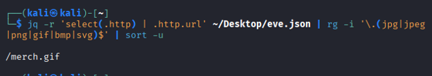
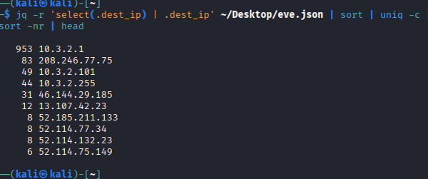
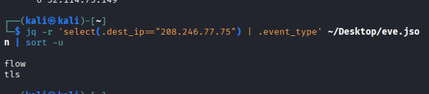

# Enumeration

## Objective 

Analyze structure network telemetry to identify indiators of compromise (IOCs), attacker infrastructure, and trough systematic data enumeration.

## Skills Demonstrated
- JSON parsing
- Threat hunting
- DNS analysis
- TLS certificate analysis
- IOC extraction
- Linux command line

## Tools
- jq
- sort
- head
- Kali Linux

## Methodology

## Problem 1

### Question 1: What is the name of the malicious image file?

Using the JQ tool (awk for .json files) I was able to extract a gif file.

This was the suspicious file.

### Question 2: What was the Victim IP (most connected to IP)?

Utilizing jq, sort (numerical order) and head (top 10), I was able to discover the top IP address victimized.

Since 10.3.2.1 is an internal IP address, it can be excluded. The next candidate was 208.246.77.75, which was the victimized IP.

### Question 3: What are the two Event Types utilized in the C2 Connection?

To determine this, I used the victimized IP (208.246.77.75) using select and searched for ".event_type"

The Two event types were flow and tls.

### Question 4: What is the Fully Qualified Domain Name of the suspicious domain the attacker connected to?

To find this, I entered the command: 

\**(jq -r --arg ip "10.3.2.101" '
  select(.src_ip==$ip and (.event_type=="dns" or .event_type=="tls" or .event_type=="http")) |
  (.dns.rrname // .dns.qname // .http.host // .tls.sni // .tls.server_name // empty)
' ~/Desktop/eve.json | sort -u)

## Findings
- Identified suspicious files and network artifacts
- Distinguished between internal and external network communication
- Located a suspicious command-and-control domain
- Extracted TLS certificate information associated with attacker infrastructure
- Demonstrated how multiple network artifacts can be correlated to support an investigation
- 
