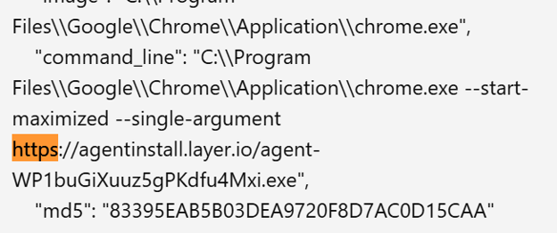
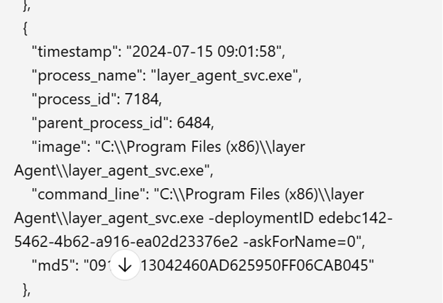
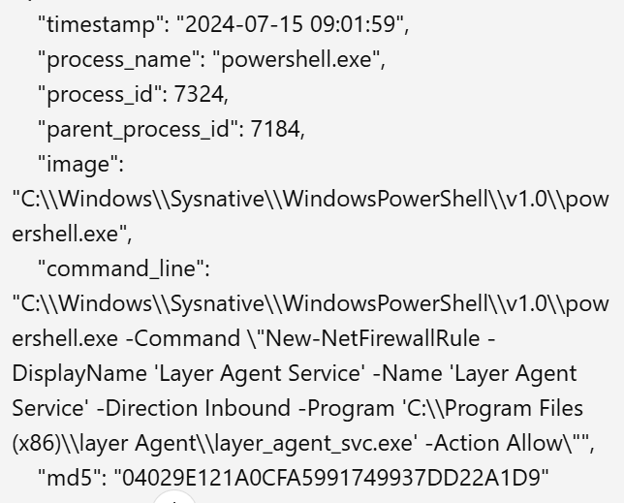

# Log Analysis

## Objective

Investigate system logs to reconstruct attacker activity, identify malicious processes, and determine how malware established persistence and modified the host environment.

## Skills Demonstrated
- Windows event log analysis
- Process tree investigation
- PowerShell analysis
- Timeline reconstruction
- Threat hunting
- Incident response

## Tools
- Windows Event Logs
- Sysmon Logs
- Log Viewer / Search Function

## Methodology 

## Problem 1

### Question 1: What bootstrap was installed?

The investigation began by locating the executable downloaded by the user's web browser. Process creation events were reviewed (uaing the word find feature for "http") to identify the bootstrap executable responsible for initiating the malware installation.

We can see the bootstrap was named "agentinstall.layer.io"

### Question 2: What's the name of the Main Agent Executable launched by the bootstrap?

By following the event log, we can demonstrate that the process "layer_agent_svc.exe" only runs after the bootstrap, meaning this was the executable.

### Question 3: Which Powershell cmdlet is used to create the agent's Firewall Rules?

By using the word search feature ("Powershell"):

We can see the service "New-NetFireWallRule" with the display name "Layer Agent Service", linking them together.

 ### Step 2 - Trace Process Execution

 Parent-child process relationships were examined to determine which executable launched after the initial bootstrap process. Following the execution chain provided insight into how the malware established itself on the system.

 

 ### Step 3 - Analyze System Modifications

 Powershell activity was reviewed to identify commands executed by the malware. Event logs revealed the creation of Windows Firewall rules. this indicates attempts to modify the host's security configurations.

 (SS)

 ## Takeaways
- Process creation logs provide valuable insight into malware execution
- Parent-child process relationships are essential for tracing attacker activity
- Powershell logs frequently reveal system configuration changes made by malware.

