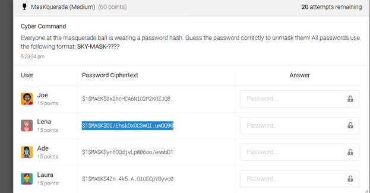
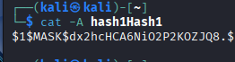
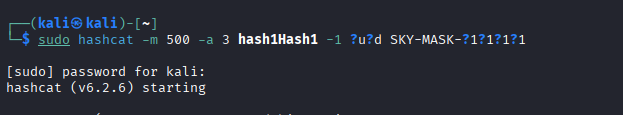
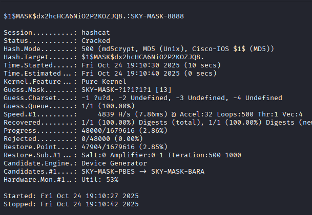
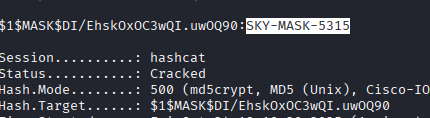

# Password Cracking

## Objective

Recover plaintext passwords from given password hashes using password-cracking techniques. The goal was to identify the appropriate hash type and apply effective cracking strategies to recover the original password.

## Skills Demonstrated

- Password hash identification
- Hashcat
- Dictionary Attacks
- Linux Command line

## Tools Used

- Hashcat
- Kali Linux Machine

## Methodology

 ### Challenge 1 - Mask Atttack

 The first challenge consisted of password hashes that followed a revealed naming convention of ('SKY-MASK-####').

 

 Given the known 8 characters and the 4 last characters were all digits, a mask attack was used to target only the unknown final 4 digits.
 We can use hashcat -500 

 
   
 
 

 This significantly reduced the search space while allowing Hashcat to recover the passwords efficiently and quickly.

 Using these, we can easily get the passwords!

  
  

 ### Challenge 2 - NTLM Dictionary Attack

 The second challenge contained NTML password hashes.

 After preparing the hash file, a dictionary attack was perfomed using the 'Rockyou.txt' wordlist. This approach compared each candidate password against the supplied hashes until matching plaintext passwords were identified.

 (SS)

 ## Takeaways

 - Selecting the correct attack is often better than blind bruce force attacks
 - Mask attacks are highly effective when portions of the password are known
 - Dictionary attacks can quickly recover weak passwords
 - Understanding hash formats is essential for password cracking
